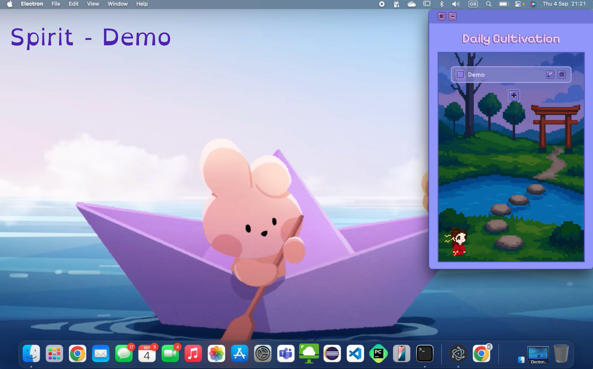
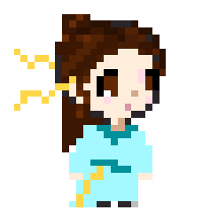
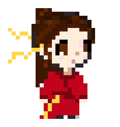
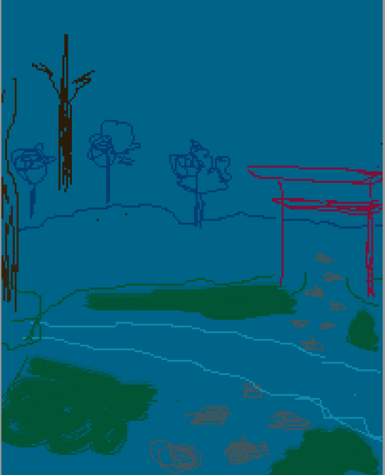
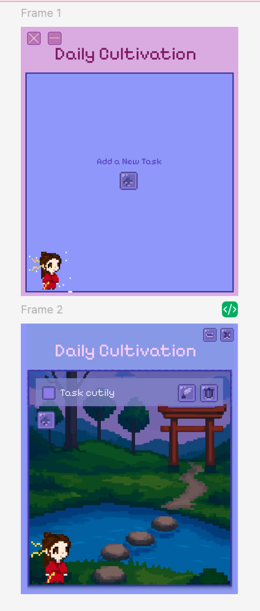

# Welcome to: Spirit✨🏮
### Demo:

  
### Main Features:
- <b>To Do List Functionality:</b> 📋
  - Add list item ➕
  - When hovered over an item, the following actions become available through dynamic buttons: 
    - Edit list item ✍️
    - Delete list item 🗑️
  - Check a list item as completed ✅
  - Uncheck a list item as uncompleted ❌
- <b>Huā (花）the motivating AI-powered companion: </b>🏮🦊
  - Possible through Gemini API integration, Huā is available to chat with by hovering over them and selecting the chat icon. 💬
  - Has an array of available animations which Huā will randomly switch through. 👯
  - Occasionally, Huā will play their flute, this comes with audio. 🪈
   
### Incoming Features:
- 'Demon Attack!' mini game.👹💥🥊
- More animations.🏮💃

  
### BTS Log:
| Description | Images |
|------|-------|
|Huā's initial design had them in a light blue hanfu! 🩵  Their current red hanfu, whilst ultimately being the colour I would have gone for anyway, was not something I actually made the final choice for. 🤔  It was purely a case where, when trialing if I even have the capability to do pixel-art and animation alone, I began to make the first animation (which was the flute playing one 🪈🎶) when their hanfu was still red. The animation turned out so well that I didn't want to risk ruining it by having to frame-by-frame change the hanfu colour! 🥲 The website I used to draw Huā did not have a sync feature for multiple frames, so I simply stuck to the red! ❤️ |   |
| I basically winged the animations for Huā, but when it came to the background, I was finally forced to actually make a sketch plan of where each component of it should go in the drawing. So, in some early prototypes, the background of Spirit looked like this: |  |
|When making the design prototype for Spirit, I trialed various colour schemes, with pink being the outside border in one. I also trialed various approaches to the to do list idea, for example, a starting menu, a starting page with just an add button in the centre, and a little logo animation before the app loads.||

